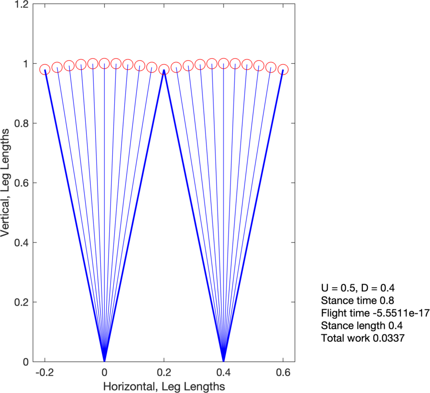
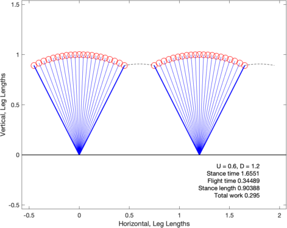
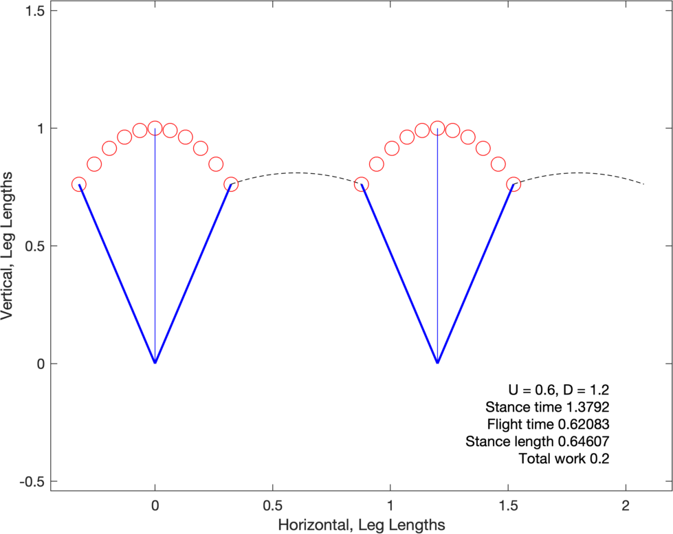

# ImpulsiveBiped

This code solves optimal bipedal locomotion with Symmetrical contacts, inspired by [Srinivasan
and Ruina 2006](https://www.nature.com/articles/nature04113), using GPOPS-II in MATLAB.

The optimal control problem is to determine the work-minimizing
symmetrical bipedal gait for a given step length ($D$) and average speed
($U$). All variables are normalized to leg length, body mass, and
gravitational acceleration.

The problem starts with contact after flight phase, with an impulsive
contact. Stance is simulated until midstance, and the behaviour is
reflected (in reverse) through the rest of stance and the next flight
phase.

## Dependencies

The optimization requires [GPOPS-II](https://www.gpops2.com/) and [SNOPT](https://ccom.ucsd.edu/~optimizers/solvers/snopt/) and has been tested on MATLAB 2019a.

## Basic useage

The script `ImpulsiveBipedHalfStanceMAIN` shows basic functionality. More specific documentation for various functions can be found by typing `help {functionName}` in the MATLAB terminal.

### Examples

#### Default guess

To find an optimal solution at nondimensional speeds of $U = 0.5$ and $D = 0.4$ from a simple guess, call 

    out = ImpulsiveBipedHalfStanceIterate(0.5,0.4,'default');

Calling
            
            plotImpulsiveBipedHalfStance(out,'TextLocation','Outside');
    
results in this figure  showing a pendular walk, as expected.

#### Random Guess

To use a random initial guess, try

    out = ImpulsiveBipedHalfStanceIterate(0.5,1.2,'rand');

Plot the solution with higher time resolution in the plot. Set the number of plotted points in stance to 21, with text plotted inside (the default):

    plotImpulsiveBipedHalfStance(out,21);
    
As the problem is non-convex, a number of alternative solutions will emerge. Some examples at $U = 0.6$, $D = 1.2$:

