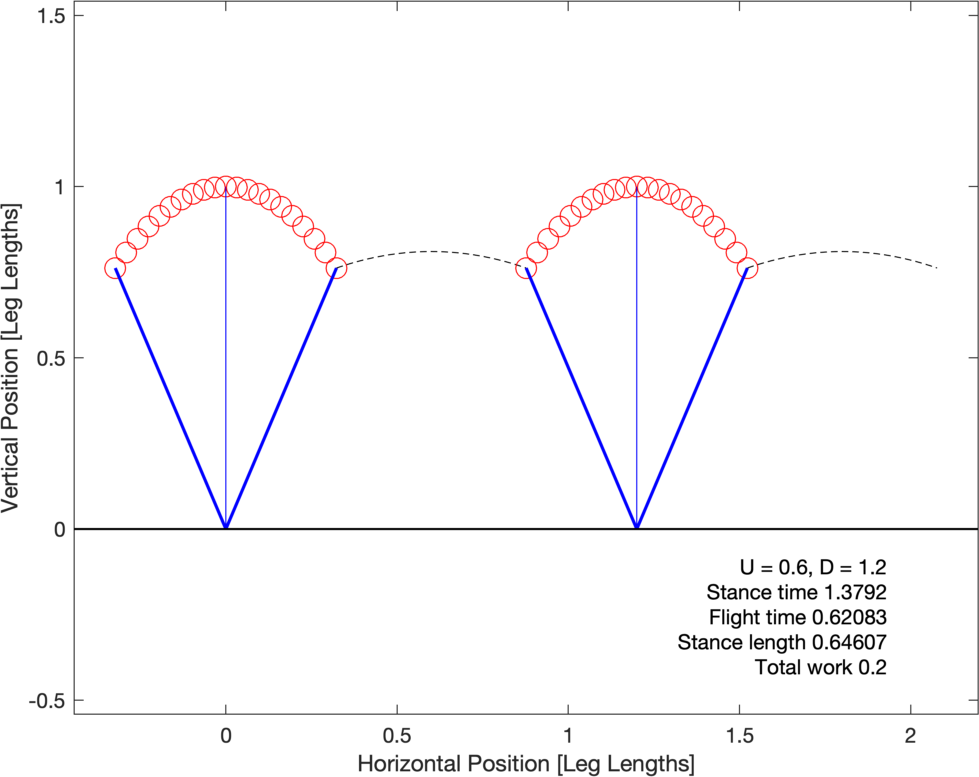

# ImpulsiveBiped

This code solves optimal bipedal locomotion with Symmetrical contacts, inspired by [Srinivasan
and Ruina 2006](https://www.nature.com/articles/nature04113), using GPOPS-II in MATLAB.

The optimal control problem is to determine the work-minimizing
symmetrical bipedal gait for a given step length ($D$) and average speed
($U$). All variables are normalized to leg length, body mass, and
gravitational acceleration.

The problem starts with contact after flight phase, with an impulsive
contact. Stance is simulated until midstance, and the behaviour is
reflected (in reverse) through the rest of stance and the next flight
phase.

## Dependencies

The optimization requires [GPOPS-II](https://www.gpops2.com/) and [SNOPT](https://ccom.ucsd.edu/~optimizers/solvers/snopt/) and has been tested on MATLAB 2019a.

## Useage

The script `ImpulsiveBipedHalfStanceMAIN` shows various examples. More specific documentation for various functions can be found by typing `help {functionName}` in the MATLAB terminal.

### ImpulsiveBipedHalfStanceIterate

This function calls the main GPOPS-II solver function (`ImpulsiveBipedHalfStance`) three times. The first two times, it uses rough solutions (one mesh iteration). These are downsampled and used as guesses for the next iteration. For the final iteration, the mesh iteration number is specified by `auxFinal.meshiteration`.

#### Default guess

To find an optimal solution at nondimensional speeds of U = 0.5 and D = 0.4 from a simple guess, call 

    [out3,out2,out1] = ImpulsiveBipedHalfStanceIterate(0.5,0.4,'default');

Calling 

            plotImpulsiveBipedHalfStance(out3,'TextLocation','Outside');
    
results in this figure 

showing a pendular walk, as expected. `ImpulsiveBipedHalfStanceIterate` creates three successive GPOPS-II outputs, but the first two are rough solutions. These can be accessed as the second and third output arguments as above.

#### Random Guess

To use a random initial guess, try

    out = ImpulsiveBipedHalfStanceIterate(0.5,1.2,'rand');

Plot the solution with higher time resolution in the plot. Set the number of plotted points in stance to 21, with text plotted inside (the default):

    plotImpulsiveBipedHalfStance(out,21);
    
As the problem is non-convex, a number of alternative solutions will emerge. Some examples at U = 0.6, D = 1.2:

#### Adjusting input parameters

Some optimization parameters can be specified with the `auxFinal` struct. To set a larger minimum time in stance, and a smaller maximum rate of change of leg force in stance,

    auxFinal.Fdotmax = 10;
    auxFinal.Tmin = 0.1;
    U = 2;
    D = 2.5;
    
    out = ImpulsiveBipedHalfStanceIterate(U,D,'default',auxFinal);
    plotImpulsiveBipedHalfStance(out);

Result:

All remaining parameters are set to default values. To determine which default values are set, run `addAuxDefaults(myAuxData);`.

### ImpulsiveBipedHalfStance

This function calls GPOPS-II to solve the optimization problem. It can be called directly. Specify the input parameters in the `aux` struct, including `aux.U` and `aux.D` for the speed and step length. Default values for optimization parameters are used if not specified in `aux`.

Next pass an argument for `guess`: this can be either a string ('rand' or 'default') or an output struct from a previous trial. *e.g.*

    aux.U = 1.5;
    aux.D = 2;
    guess = 'default';
    out = ImpulsiveBipedHalfStance(aux,guess);
    plotImpulsiveBipedHalfStance(out,5);

